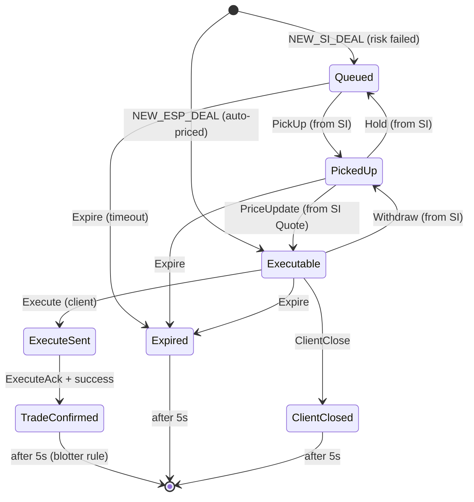
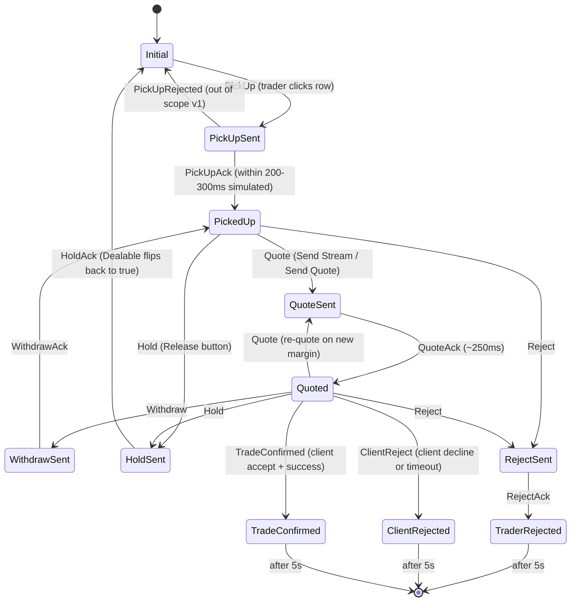

# 03 — Trade State Model

This document uses Caplin's **canonical state and event names** from https://docs.caplin.com/developer/fx-sales/st-implementing-sales-intervention. Two trade models run in parallel: the **RFS Trade Model** (the client-side quote lifecycle) and the **Sales Intervention (SI) Trade Model** (the sales-trader-side intervention lifecycle). Per Caplin: "Some transitions in the two models are related. For example, when a sales trader picks up a trade for intervention, the Sales Intervention Model transitions to `PickUpSent` and the RFS Trade Model transitions to `PickedUp`. The relationship between the two trade models is not handled automatically by the FX Integration API. It must be coded at the implementation level."

In a real Caplin deployment, both models live on the backend and the FX Sales client subscribes to their state. In **this prototype** we simulate both models inside the browser: each `Deal` owns one RFS state machine and one SI state machine, and the relationships listed in §3 below are implemented as cross-machine sends inside the dealMachine actor.

## 1. RFS Trade Model — states

The states of the RFS Trade Model (per the Caplin diagram on the implementation page):

| State | Meaning |
|---|---|
| `Initial` | New trade request created |
| `Submitted` | Client has submitted the request |
| `Queued` | Submission acknowledged; awaiting processing. **A trade that fails risk assessment stays in `Queued` and is surfaced to the Active Deals Blotter.** |
| `PickedUp` | A sales trader has picked the trade up for intervention (driven by an SI-side `PickUp` event) |
| `Executable` | A price has been delivered to the client and is executable |
| `ExecuteSent` | Client has requested execution; in flight |
| `Executed` | Execution acknowledged by the server |
| `WarningSent` | Pre-trade warning shown to the client |
| `AcceptWarningSent` | Client has accepted the warning; in flight |
| `TradeConfirmed` | Trade booked (terminal) |
| `ClientCloseSent` | Client-initiated close in flight |
| `ClientClosed` | Client closed the trade (terminal) |
| `Expired` | Quote/trade expired (terminal) |

### RFS events

`Submit`, `SubmitAck`, `PickUp`, `Hold`, `PriceUpdate`, `Withdraw`, `Execute`, `ExecuteAck`, `Warning`, `TradeConfirmation`, `AcceptWarning`, `RejectWarning`, `ClientClose`, `Expire`, `AcceptWarningAck`, `ClientCloseAck`.

### What this prototype implements from the RFS model

For the v1 prototype we collapse the RFS state machine to the **subset of states the UI cares about**: `Queued`, `PickedUp`, `Executable`, `Executed`/`TradeConfirmed`, `Expired`, `ClientClosed`. The warning/accept-warning sub-flow is out of scope. Submitted is collapsed into Queued for v1 (no auto-pricer to simulate that hop). The RFS state is never shown directly in the UI — it is consumed by the dealMachine to gate SI transitions.

## 2. Sales Intervention Trade Model — states

States (per the Caplin diagram on the implementation page):

| State | Meaning |
|---|---|
| `Initial` | SI machine instantiated; awaiting trader pickup |
| `PickUpSent` | Trader clicked Pick Up; in flight |
| `PickUpPending` | Pickup is pending (e.g. another trader's pickup is in race); resolves to `PickedUp` or `PickUpRejected` |
| `PickedUp` | Pickup acknowledged; trader has the ticket; **prevailing price stream is delivered** via `PriceUpdate` |
| `TraderAccepted` | Trader accepted the prevailing price (without re-quoting) |
| `QuoteSent` | Trader sent a quote with adjusted rate/margin; in flight |
| `Quoted` | Quote acknowledged; live with the client |
| `WithdrawSent` | Trader clicked Withdraw; in flight |
| `HoldSent` | Trader clicked Hold (Release); in flight — gives the ticket back to the desk |
| `TradeConfirmationHeld` | A trade confirmation is being held by the trader (advanced flow; out of scope v1) |
| `RejectSent` | Trader clicked Reject; in flight |
| `TraderRejected` | Reject acknowledged (terminal) |
| `ClientRejected` | Client rejected/closed/timed out (terminal) |

### SI events

`PickUp`, `PickUpAck`, `PickUpRejected`, `PriceUnavailable`, `PriceUpdate`, `Accept`, `Hold`, `HoldAck`, `Reject`, `RejectAck`, `ClientReject`, `Quote`, `QuoteAck`, `Withdraw`, `WithdrawAck`, `TradeConfirmed`.

### A note on the `*Sent` states

States like `PickUpSent`, `QuoteSent`, `WithdrawSent`, `RejectSent`, `HoldSent` represent **in-flight** actions awaiting an acknowledgement from the trading backend. In a real deployment these are visible because there is real network latency. In this prototype we honor the model by inserting a **simulated 200-300ms acknowledgement delay** for each — long enough for the UI to show a "sending" affordance on the action button (button spinner / disabled state) but short enough that the demo flows smoothly.

## 3. The RFS ↔ SI relationship

These are the cross-model transitions described in the Caplin "Implementation" section. The prototype implements each one inside the dealMachine actor by sending events into the partner machine when the trigger event lands on this machine.

| Trigger | Caplin handler | Cross-model action |
|---|---|---|
| RFS `onSubmit` for a trade that **fails risk assessment** | `RFSTradeListener.onSubmit` | Leave RFS in `Queued`; add to Active Deals Blotter; **no SI machine yet** (it spawns on PickUp). For the prototype: the DealFeed emits a `NEW_SI_DEAL` event which creates the deal with RFS=`Queued`, SI=`Initial`, and the row appears in the blotter with `Dealable=true`. |
| SI `onPickup` (trader clicks row) — **dealable** | `SITradeListener.onPickup` | (1) Raise `PickUp` on RFS → RFS goes to `PickedUp`; (2) Raise `PickUpAck` on SI → SI goes to `PickedUp`; (3) Raise `PriceUpdate` on SI → ticket starts receiving prevailing prices. |
| SI `onPickup` — **not dealable** | `SITradeListener.onPickup` | Raise `PickUpRejected` on SI. (Out of scope v1 — we don't simulate trader contention.) |
| SI `onQuote` (trader clicks Send Stream / Send Quote) | `SITradeListener.onQuote` | (1) Raise `QuoteAck` on SI → SI goes to `Quoted`; (2) Raise `PriceUpdate` on RFS → RFS goes to `Executable`. |
| SI `onWithdraw` (trader clicks Withdraw) | `SITradeListener.onWithdraw` | (1) Raise `Withdraw` on RFS → RFS goes from `Executable` back to `PickedUp`; (2) Raise `WithdrawAck` on SI → SI goes back to `PickedUp`. |
| SI `onReject` (trader clicks Reject) | `SITradeListener.onReject` | (1) Raise `Reject` on RFS → RFS terminal; (2) Raise `RejectAck` on SI → SI terminal `TraderRejected`; (3) Schedule removal from the Active Deals Blotter (the 5-second rule). |
| SI `onHold` (trader clicks Release) | `SITradeListener.onHold` | (1) Raise `Hold` on RFS → RFS goes from `PickedUp` back to `Queued`; (2) Raise `HoldAck` on SI → SI returns to `Initial`/awaiting state. **The row's `Dealable` flag flips back to true** so another trader could pick it up. |
| RFS `onTradeClose` (quote timeout) | `RFSTradeListener.onTradeClose` | Raise `ClientReject` on SI → SI terminal `ClientRejected`. |
| RFS `onClientClose` (client declined) | `RFSTradeListener.onClientClose` | Raise `ClientReject` on SI → SI terminal `ClientRejected`. |
| RFS `onExecute` (client accepted) | `RFSTradeListener.onExecute` | (1) Raise `ExecuteAck` on RFS; (2) Execute on backend; (3) On success: raise `TradeConfirmed` on both RFS and SI → both terminal `TradeConfirmed`; (4) On failure: raise `Reject` on both. |

## 4. Mermaid state diagrams

### RFS Trade Model (prototype subset)



### Sales Intervention Trade Model (prototype subset)



## 5. Active Deals Blotter container contract

Per the Caplin implementation page, when a quote enters intervention, the integration adapter adds it to the container subscribed by the Active Deals Blotter. Required fields:

- `TradeRequestId` — unique identifier; used to match SI events to deals.
- `Dealable` — boolean; `true` if no trader has picked the deal up, `false` once picked up. **This is the field other traders watch to see if a deal is available for pickup.**

Caplin container subject in the real product: `/PRIVATE/FX/SALES/BLOTTER/ACTIVEDEALS`. The prototype does not use Caplin's subject namespace, but the field names `TradeRequestId` and `Dealable` are preserved on the `Deal` type so the data shape matches.

## 6. XState implementation

Defined in `src/state/machines/`. Two machines per deal, both children of a `dealMachine` actor that owns the cross-model coordination:

- `rfsMachine.ts` — implements the RFS subset.
- `siMachine.ts` — implements the SI subset.
- `dealMachine.ts` — spawns both, routes incoming events to the right child, and implements the cross-model relationships in §3 as actions on transitions.

### Why two machines, not one combined

The Caplin docs are explicit that these are **two distinct trade models running in parallel with documented relationships**. Modelling them as a single flat machine collapses the design and loses the clarity of "this is an RFS-side concern" vs "this is an SI-side concern". The two-machine approach mirrors the real implementation and makes the v2 path (swapping the dummy feed for a real Caplin StreamLink integration) cleaner — each child machine can become a thin adapter onto the real Caplin state.

### Context (per-deal)

```typescript
type DealContext = {
  // Identity & blotter
  dealId: string;            // == TradeRequestId
  dealable: boolean;          // surfaces the SI `Dealable` flag
  pickedUpBy?: string;        // populated on PickUpAck

  // Trade economics
  clientName: string;
  accountCode: string;
  pair: string;
  side: 'BUY' | 'SELL';
  notional: number;
  tenor: 'SPOT';
  rejectionReasons: RejectionReason[];

  // Pricing state
  marginPips: number;         // current trader margin
  isFixedMode: boolean;       // false = streaming, true = fixed rate
  capturedRate?: number;      // set on Quote (single-quote mode)
  finalRate?: number;         // set on TradeConfirmed

  // Timing
  createdAt: number;
};
```

### Status displayed in the blotter

The blotter row's status pill shows a **derived label**, not a raw state name. The derivation lives in `src/features/blotter/statusFromMachines.ts` and uses both machines' current states:

| Display label | RFS state | SI state | When |
|---|---|---|---|
| `INTERVENE` | `Queued` | `Initial` | Awaiting pickup; `Dealable === true` |
| `PICKING UP` | `Queued` | `PickUpSent` | In-flight pickup |
| `PICKED UP` | `PickedUp` | `PickedUp` | Trader has the ticket, no quote sent yet |
| `STREAMING` | `Executable` | `Quoted` | Quote live with client |
| `WITHDRAWING` | `Executable` | `WithdrawSent` | Withdraw in flight |
| `RELEASING` | `PickedUp` | `HoldSent` | Hold/Release in flight |
| `REJECTING` | `PickedUp`/`Executable` | `RejectSent` | Reject in flight |
| `AUTO` | `Executable` | `Initial` | ESP path; no SI involvement |
| `DONE` | `TradeConfirmed` | `TradeConfirmed` | Terminal success |
| `REJECTED` | (any) | `TraderRejected` | Terminal — trader |
| `DECLINED` | (any) | `ClientRejected` | Terminal — client |
| `EXPIRED` | `Expired` | (any) | Terminal — timeout |

## 7. Side effects and timers

- **Simulated ack delays:** each `*Sent` state has an `after: { 250: 'NextState' }` transition to simulate the ack. The exact duration is a constant in `src/state/machines/timings.ts` so it can be tuned (or zeroed for tests).
- **Quote validity timer:** `Quoted` state has `after: { 30000: ClientReject }` to simulate quote timeout. Scenario scripts can fire `ClientAccept` before that deadline.
- **5-second blotter removal:** every terminal state on the SI side schedules a `removeFromActive` action 5 seconds after entry. This is enforced via `xstate`'s `after` transitions — see `02-functional-spec.md §Active Blotter §5-second removal rule`.

## 8. Testability

Each blotter row carries:

```html
<tr
  data-deal-id="d_001"
  data-rfs-state="PickedUp"
  data-si-state="Quoted"
  data-display-status="STREAMING"
  data-dealable="false"
>
```

Playwright tests assert on `data-si-state` (the most informative) and `data-display-status` (the user-facing label). Both must remain stable parts of the test contract.

## 9. Out of scope for v1

- `PickUpPending` and `PickUpRejected` paths (no multi-trader contention).
- `TraderAccepted` flow (accepting prevailing price without re-quoting); the prototype always goes via `Quote`.
- `TradeConfirmationHeld` state.
- The Warning / AcceptWarning sub-flow on the RFS side.
- The `Submitted` → `Queued` hop (we synthesise `Queued` directly).
- `Hold` from `Quoted` state (Release after a quote is out) — only `Hold` from `PickedUp` is supported.

## 10. Anti-patterns

- **Do not collapse** RFS and SI into one machine. The Caplin docs are explicit they are separate.
- **Do not skip** the `*Sent` → `*Ack` transitions even though they could compile away — the simulated delay is part of the UX fidelity.
- **Do not derive status labels** anywhere except `statusFromMachines.ts`.
- **Do not mutate** `dealable` directly — it is set as an entry action on the appropriate SI states.
