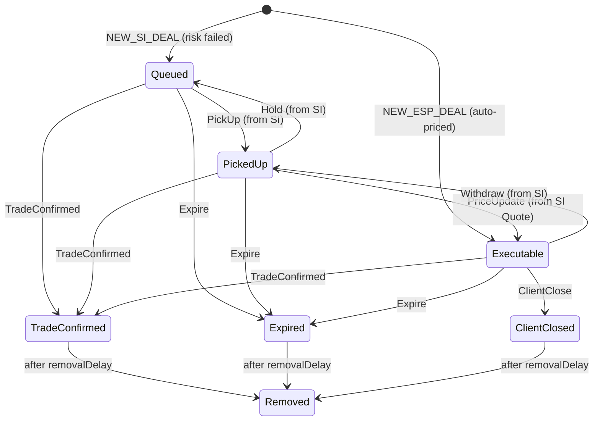

# Component — `rfsMachine`

XState machine modelling the client-side **Request for Stream (RFS)** lifecycle. One per deal, spawned as a child of the parent [dealMachine](deal-machine.md). The RFS state is **never shown directly in the UI** — it is consumed by the parent and by [status-derivation.md](status-derivation.md) to gate the display-status label.

File: `src/state/machines/rfsMachine.ts`.

## States (v1 prototype subset)

| State | Meaning |
|---|---|
| `Queued` | Submission received; for SI-eligible deals, surfaced to the Active Blotter with `Dealable=true`. Initial state. |
| `PickedUp` | A sales trader has picked the trade up for intervention. |
| `Executable` | A price has been delivered to the client and is executable. |
| `TradeConfirmed` | Trade booked. Terminal (with `after: removalDelay → Removed`). |
| `Expired` | Quote/trade timed out. Terminal. |
| `ClientClosed` | Client closed the trade. Terminal. |
| `Removed` | Hidden cleanup state reached 5 seconds after any terminal. Triggers archival in the [dealsStore](deals-store.md). |

The canonical full state set includes `Initial`, `Submitted`, `ExecuteSent`, `Executed`, `WarningSent`, `AcceptWarningSent`, `ClientCloseSent`. All of those are out of scope for v1 — see [Out of scope](#out-of-scope) below.

## Events

`PickUp`, `Hold`, `PriceUpdate`, `Withdraw`, `TradeConfirmed`, `ClientClose`, `Expire`. The parent dealMachine raises these in response to its own trader-driven events per the cross-model coordination table (see [deal-machine.md](deal-machine.md)).

## Transitions

ESP deals start at `Executable` directly (auto-priced); SI-eligible deals start at `Queued`.

## Why the `Removed` state

`xstate` v5 doesn't cleanly allow `after` transitions on `final` states. Modelling cleanup as a regular state reached via `after: { removalDelay: 'Removed' }` is idiomatic and lets the [dealsStore](deals-store.md) observe the transition and run archival. See `docs/dev-log.md` FXSW-010 entry for the design rationale.

## ESP terminal coordination

For ESP deals (auto-priced), SI stays at `Initial` for the whole deal — there is no intervention. When RFS reaches `TradeConfirmed`, the parent dealMachine raises a synthetic `TradeConfirmed` on the SI machine via a guarded `Initial → TradeConfirmed` transition. This preserves the two-machine symmetry — every deal has both machines reach a terminal state — and means status derivation doesn't need an ESP special case.

## `*Sent` acknowledgement asymmetry (FXSW-088 F-2)

Unlike the [SI machine](si-machine.md) — which models the simulated backend ack with explicit `*Sent` states (`QuoteSent`, `WithdrawSent`, …) — **RFS has no `*Sent` states**, and that asymmetry is deliberate. RFS `Executable` means "auto-/re-priced and dealable"; it is **not** the client-facing "price sent" signal. The single source of truth for "a price was sent to the client" is the **SI** side (`QuoteSent → Quoted`): status derivation requires SI `Quoted` for `STREAMING`, and the quote-context capture records at SI `QuoteSent`. **No consumer may read RFS `Executable` as the sent signal.** Adding `*Sent` states to RFS would change canonical state names and the ESP `Queued → Executable` auto-price path, so the asymmetry is documented and constrained here rather than made symmetric. (Flagged in `security/FXSW-077`/`FXSW-081` lineage; documented at FXSW-088.)

## Out of scope

- `Submitted` → `Queued` hop (we synthesise `Queued` directly; no auto-pricer to simulate the hop).
- `ExecuteSent` / `Executed` split — the prototype collapses `Execute` + `ExecuteAck` into a direct `TradeConfirmed` transition.
- Warning / AcceptWarning sub-flow.

## Test contract

State name surfaces on each blotter row as `data-rfs-state`. See [active-blotter.md](../features/active-blotter.md) for the full row attribute list.

## Tests

`src/state/machines/rfsMachine.test.ts` — **2 cases**. Starts in `Queued`; `PickUp` transitions to `PickedUp`. The full state graph is exercised end-to-end through the parent [dealMachine](deal-machine.md) tests.

## Sources

- `docs/03-trade-state-model.md` §1, §3, §4, §9 — RFS states, RFS↔SI relationships, Mermaid diagram, out-of-scope items
- `docs/dev-log.md` FXSW-010 — implementation notes
- `docs/BACKLOG.md` FXSW-010 — implementation ticket
