# Component — `siMachine`

XState machine modelling the trader-side **Sales Intervention (SI)** lifecycle. One per deal, spawned as a child of the parent [dealMachine](deal-machine.md). The SI state is the primary driver of [status-derivation.md](status-derivation.md) and gates which footer actions are visible on the [ticket](../features/ticket.md).

File: `src/state/machines/siMachine.ts`.

## States (v1 prototype)

| State | Meaning |
|---|---|
| `Initial` | SI machine instantiated; awaiting trader pickup. |
| `PickUpSent` | Trader clicked Pick Up; ack in flight. ~250ms simulated delay. |
| `PickedUp` | Ack received; ticket active with prevailing prices streaming. |
| `QuoteSent` | Send Stream or Send Quote clicked; ack in flight. ~250ms. |
| `Quoted` | Quote live with the client. |
| `WithdrawSent` | Withdraw clicked; ack in flight. ~250ms. |
| `HoldSent` | Hold (Release) clicked; ack in flight. ~250ms. |
| `RejectSent` | Reject clicked; ack in flight. ~250ms. |
| `TraderRejected` | Reject acknowledged. Terminal. |
| `ClientRejected` | Client declined or timed out. Terminal. |
| `TradeConfirmed` | Trade booked. Terminal. |
| `Removed` | Hidden cleanup state reached 5 seconds after any terminal. Triggers archival in the [dealsStore](deals-store.md). |

## Events

`PickUp`, `Quote`, `Withdraw`, `Hold`, `Reject`, `ClientReject`, `TradeConfirmed`. The `*Ack` transitions are modelled as `after` transitions, not as external events.

## Transitions

```mermaid
stateDiagram-v2
    [*] --> Initial

    Initial --> PickUpSent : PickUp
    PickUpSent --> PickedUp : (after ackDelay)

    PickedUp --> QuoteSent : Quote
    QuoteSent --> Quoted : (after ackDelay)
    Quoted --> QuoteSent : Quote (re-quote on new margin)

    Quoted --> WithdrawSent : Withdraw
    WithdrawSent --> PickedUp : (after ackDelay)

    PickedUp --> HoldSent : Hold
    Quoted --> HoldSent : Hold
    HoldSent --> Initial : (after ackDelay; Dealable flips back to true)

    PickedUp --> RejectSent : Reject
    Quoted --> RejectSent : Reject
    RejectSent --> TraderRejected : (after ackDelay)

    Quoted --> ClientRejected : ClientReject
    Quoted --> TradeConfirmed : TradeConfirmed

    TraderRejected --> Removed : after removalDelay
    ClientRejected --> Removed : after removalDelay
    TradeConfirmed --> Removed : after removalDelay
```

ESP deals: SI stays at `Initial` indefinitely; on RFS `TradeConfirmed` the parent fires a synthetic `TradeConfirmed` on SI via a guarded `Initial → TradeConfirmed` transition. See [rfs-machine.md](rfs-machine.md) §ESP-terminal-coordination.

## Why `*Sent` states are not skippable

States like `PickUpSent`, `QuoteSent`, `WithdrawSent`, `RejectSent`, `HoldSent` represent **in-flight** actions awaiting backend acknowledgement. Each transitions to its post-ack state via an `after: { ackDelay: 'NextState' }` transition. The delay is sourced from `src/state/machines/timings.ts` (`ackDelayMs = 250` by default; zero-able in tests via `timings.ackDelayMs = 0`).

Rationale captured in [decisions/ADR-0009-simulated-ack-delays.md](../decisions/ADR-0009-simulated-ack-delays.md).

## Why a `Removed` cleanup state

XState v5 doesn't cleanly allow `after` transitions on `final` states. The hidden `Removed` state reached via `after: { removalDelay: 'Removed' }` is idiomatic and lets the [dealsStore](deals-store.md) observe the transition and schedule archival via `queueMicrotask` (deferring so the actor isn't stopped mid-subscription-callback). See `docs/dev-log.md` FXSW-010 entry.

## Out of scope

- `PickUpPending` / `PickUpRejected` paths (no multi-trader contention in v1).
- `TraderAccepted` flow (accepting prevailing price without re-quoting); the prototype always goes via `Quote`.
- `TradeConfirmationHeld` state.

## Test contract

State name surfaces on each blotter row as `data-si-state`. Most informative attribute for Playwright assertions. See [active-blotter.md](../features/active-blotter.md).

## Sources

- `docs/03-trade-state-model.md` §2, §3, §4, §7, §9 — SI states, cross-model relationships, side-effect timers, out-of-scope items
- `docs/dev-log.md` FXSW-010 — implementation notes
- `docs/BACKLOG.md` FXSW-010 — implementation ticket
